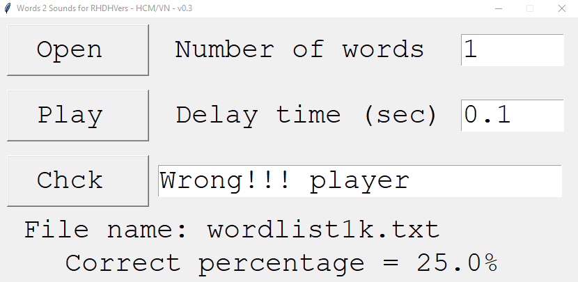

# PyTalk
A tool for practicing English

After the first launch, I got many response and requests to upgrade the tool from you (my RHDHV colleagues). Thanks a lot for your motivation. 

Here is the second upgrade of the tool. In this version, besides the SHADOWING MODE, you have also the CHECKING MODE to hear one word at a time and check if you hear a word correctly or not. 

**How to use the tool:**
Step 1) Press “Open” to load a file of list of words to be randomly read for you.
Step 2) Fill in the Number of words (N) to be read; N should be an integer number. There are two modes now:
            N > 1: Shadowing mode -> continuously read N words, each word once
            N = 1: Checking mode    -> read one word 3 times
Step 3) Fill in the Delay time (S) to wait between two readings; S can be a float number. 
Step 4) Press “Play” to listen on the mode chosen.
            If the mode is Shadowing, N random words will be automatically read.
            If the Checking mode is chosen, after listening, you can type in the long box the word you heard and press “Chck” to check if it is correct or not.

**Other:**
The fourth line on the GUI is the name of the wordlist file.
The fifth line on the GUI presents the correct percentage of your answer when you are in the Checking mode.

I hope this tool with assist you well during your practicing with English.

